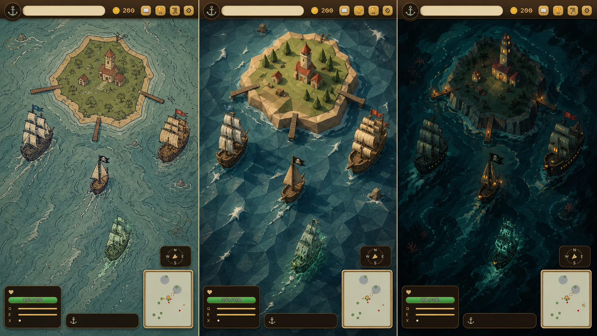
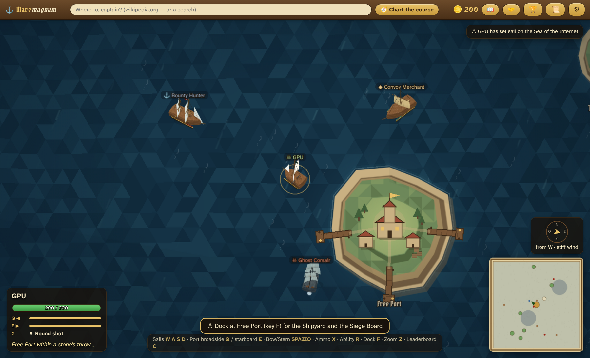

# Art bible — Diorama nautico dipinto

Questa è la direzione artistica di riferimento di Maremagnum. La reference
approvata è il pannello centrale della tavola comparativa del 20 luglio 2026.
Non è realismo in miniatura: è un teatrino navale intagliato, dipinto e
illuminato con regole semplici abbastanza da restare leggibile durante il
gioco.

La prima vertical slice applicata al renderer reale è qui:

## Le cinque regole

1. **Sagoma prima del dettaglio.** Nave, fazione, landmark e costa devono
   essere riconoscibili in nero pieno e a 320 px di larghezza.
2. **Tre valori per materiale.** Ogni materiale usa un tono d'ombra, uno medio
   e uno di luce; niente rumore continuo o gradienti fotografici.
3. **Luce da nord-ovest.** Luce calda in alto a sinistra, ombra compatta verso
   sud-est. Il ciclo giorno/notte cambia intensità e tinta, non la logica.
4. **Dettaglio a grappoli.** Props e vegetazione formano piccoli gruppi attorno
   a un landmark, separati da vuoti intenzionali. Mai coriandoli uniformi.
5. **Gameplay più saturo del fondale.** Oro, rosso, verde e colori di fazione
   appartengono a decisioni e minacce. Acqua e terra restano smorzate.

## Forme e materiali

- Acqua: triangoli larghi e bande direzionali; creste corte, chiare e rade.
  Vietate chiazze sfocate e grana ad alta frequenza.
- Isole: battigia, scogliera e altopiano sono tre quote visibili. Il bordo è
  spezzato ma ha masse grandi; niente poligoni con rumore a ogni vertice.
- Edifici: tetti grandi, pareti chiare, ombre portate. Una costruzione domina
  ogni insediamento e racconta la funzione del luogo.
- Legno: bruno caldo, facce illuminate color miele, tagli quasi neri. Ottone
  solo su strumenti, fregi e azioni primarie.
- Tela: massa chiara che domina la sagoma delle navi. Le fazioni cambiano
  rapporto tra scafo, alberi e vele prima ancora del colore.

## Fazioni

| Fazione | Sagoma | Ritmo | Accento |
|---|---|---|---|
| Ciurma Libera | bassa, asimmetrica, vele rattoppate | diagonali e improvvisazione | ruggine/corallo |
| Compagnia | scafo panciuto, carico in vista, velatura larga | masse orizzontali | ottone/canapa |
| Marina | scafo stretto, alberi alti, vele ordinate | verticali e ripetizione | blu ardesia/avorio |

Le targhette confermano l'identità; non devono crearla.

## Scala e gerarchia

- A zoom 1× una nave ordinaria occupa circa 70–90 px nella dimensione
  principale; mercantili e navi di linea possono superarla.
- Il landmark del porto è almeno tre volte una casa comune.
- Il giocatore è il primo contrasto mobile; la meta è il primo contrasto
  statico; l'HUD diventa dominante solo quando chiede una decisione.
- In una schermata ordinaria deve esserci almeno un soggetto leggibile oltre
  all'interfaccia. Il mare aperto usa rotte, creste e incontri per evitare il
  vuoto inerte.

## Movimento

- Ogni azione importante ha preparazione, contatto e recupero.
- Scie e schiuma seguono masse e direzione: pochi segni larghi, non particelle
  casuali.
- Il Mare calmo conserva la composizione e spegne soltanto il movimento di
  contorno, come richiesto dall'accessibilità.

## Interfaccia

- Pergamena, rovere e ottone restano il linguaggio dei pannelli e delle scelte.
- Durante la navigazione le superfici diventano più trasparenti, i bordi più
  sottili e le ombre più corte: il mondo deve avere più presenza della cornice.
- Oro pieno e placca rialzata sono riservati alle azioni primarie.

## Criteri della vertical slice

- Il Porto Franco è riconoscibile dalla torre e dalla costa anche senza nome.
- Battigia, scogliera e altopiano si distinguono a 1×.
- Compagnia, Marina e Ciurma si distinguono senza targhette.
- Acqua e terra condividono facce grandi, luce e contrasto dei bordi.
- Il giocatore resta leggibile senza che la targhetta pesi più della nave.
- Lo screenshot di gioco appare deliberatamente low-poly, non provvisorio.
